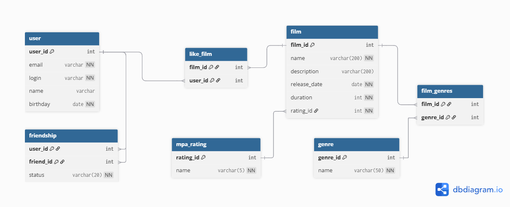

# Filmorate
Учебный проект с курса "Java-разработчик" от Яндекс Практикума.
Проект является backend-сервисом для получения топа фильмов, рекомендованных к просмотру на основе пользовательских оценок. </br>
**Стек: Java 21, Spring Boot, Apache Maven, REST, Postman, Lombok, JUnit 5**

### Содержание
- [Этапы работы над проектом](#этапы-работы-над-проектом)
- [ER-диаграмма](#er-диаграмма)
- [Примеры запросов к базе данных](#примеры-запросов-к-базе-данных)

## Текущий этап работы над проектом:
Спринт 12:
- Переработана архитектура проекта;
- Добавлены новые модели: MPA-рейтинг, Genre, Likes, Friendship;
- Добавлен слой DAL для работы с данными из базы данных;
- Добавлен маппинг для преобразования записей из базы данных в объекты и обратно;
- Написаны интеграционные тесты;
- Добавлены тестовые хранилища для unit-тестов;
- Переработаны unit-тесты для граничных условий с учетом новой архитектуры проекта;

## Этапы работы над проектом
1. Спринт 10:
    - Создание каркаса приложения с использользованием Spring Boot;
    - Вся логика и хранение данных находятся в контроллерах;
    - Разработан базовый функционал: добавление, обновление и получение всех фильмов/пользователей;
    - Написаны unit-тесты для текущего функционала.
2. Спринт 11:
    - Добавлены классы-хранилища для работы с данными о фильмах и пользователях;
    - Добавлен новый функционал, позволяющий добавлять друзей и ставить лайки фильмам;
    - Добавлены аннотации @service и @component для внедрения зависимостей;
    - В классы контроллеры добавлена аннотация @ResponseStatus для указания HTTP-статуса ответа, который должен вернуться при обработке запроса;
    - Добавлены классы ErrorHandler и ErrorResponse для централизованной обработки ошибок;
    - Добавлены unit-тесты для нового функционала.
3. Спринт 12. Промежуточное задание:
   - Спроектирована будущая база данных;
   - Создана ER-диаграмма базы данных.

## ER-диаграмма


## Примеры запросов к базе данных

1. Получить всех пользователей, кто родился не раньше 1995 года
```sql
SELECT u.user_id, u.email, u.login, u.name, u.birthday
FROM users AS u
WHERE EXTRACT(YEAR
              FROM birthday) >= 1995
ORDER BY birthday
```
2. Получить фильмы, у которых не меньше двух лайков
```sql
SELECT f.film_id,
       f.name AS title,
       f.description,
       f.release_date,
       m.name AS mpa_rating,
       COUNT(l.user_id) AS likes_count
FROM films AS f
LEFT JOIN likes l ON f.film_id = l.film_id
JOIN mpa_rating AS m ON f.rating_id = m.rating_id
GROUP BY f.film_id, m.name
HAVING COUNT(l.user_id) >= 2
ORDER BY likes_count DESC;
```

3. Получить пользователей, у которых яндекс почта
```sql
SELECT u.user_id,
       u.email,
       u.login,
       u.name
FROM users AS u
WHERE email LIKE '%yandex%' OR email LIKE '%@ya.ru%'
ORDER BY user_id
```